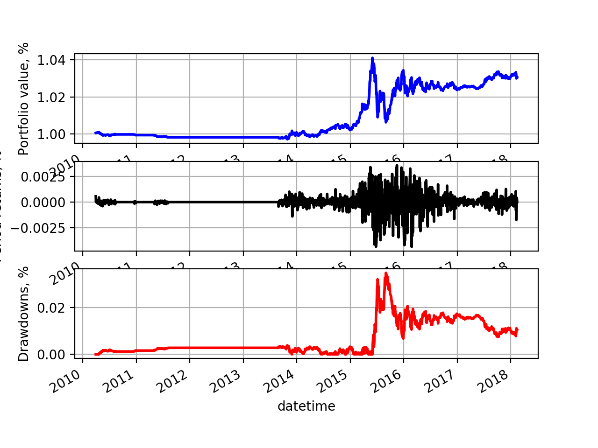

# trading_system

This is my initial trading system. The running environment is python 3.5
Most of these code comes from they book `successful trading algorithm`. I just fixed part of bugs


## how to use

Before you run it you need to change the directory of your data.

To run the mac strategy, use "python mac.py"
To plot the performance, use "python plot_performance.py" to plot drawdown, Portfolio value, period returns

# 说明
以上是原作者的说明，以下是我的说明
代码 fork 自 [AlphaSue/trading_system](https://github.com/AlphaSue/trading_system)，当前主要是适配了国内证券的交易规则，目前修改的地方有：

- 数据获取由原来的本地 CSV 文件，改成直接从 tushare 模块获取
- 修改了几处代码，用于兼容最新的 pandas 版本

## 使用方法

程序在 python3.5 及以上版本测试通过，首选需要安装以下模块

`pip install tushare pandas numpy`

运行方法：

```shell
#对默认股票(601166)做回测测试
python3 ./mac.py
LONG: 2006-06-02 00:00:00
SHORT: 2008-07-28 00:00:00
LONG: 2009-07-28 00:00:00
SHORT: 2010-09-07 00:00:00
LONG: 2010-12-01 00:00:00
SHORT: 2012-02-07 00:00:00
LONG: 2013-04-08 00:00:00
SHORT: 2014-08-25 00:00:00
LONG: 2015-05-20 00:00:00
SHORT: 2015-11-06 00:00:00
LONG: 2017-07-04 00:00:00
SHORT: 2017-09-07 00:00:00
Creating summary stats...
Creating equity curve...
            600387     cash  commission    total  returns  equity_curve  \
datetime
2018-02-02     0.0  99615.6        15.6  99615.6      0.0      0.996156
2018-02-05     0.0  99615.6        15.6  99615.6      0.0      0.996156
2018-02-06     0.0  99615.6        15.6  99615.6      0.0      0.996156
2018-02-07     0.0  99615.6        15.6  99615.6      0.0      0.996156
2018-02-08     0.0  99615.6        15.6  99615.6      0.0      0.996156
2018-02-09     0.0  99615.6        15.6  99615.6      0.0      0.996156
2018-02-12     0.0  99615.6        15.6  99615.6      0.0      0.996156
2018-02-13     0.0  99615.6        15.6  99615.6      0.0      0.996156
2018-02-14     0.0  99615.6        15.6  99615.6      0.0      0.996156
2018-02-14     0.0  99615.6        15.6  99615.6      0.0      0.996156

            drawdown
datetime
2018-02-02  0.015979
2018-02-05  0.015979
2018-02-06  0.015979
2018-02-07  0.015979
2018-02-08  0.015979
2018-02-09  0.015979
2018-02-12  0.015979
2018-02-13  0.015979
2018-02-14  0.015979
2018-02-14  0.015979
[('Total Return', '-0.38%'),
 ('Sharpe Ratio', '-0.07'),
 ('Max Drawdown', '1.91%'),
 ('Drawdown Duration', '2329')]
Signals: 12
Orders: 12
Fills: 12
```
```shell
# 指定一只股票做测试
python3 ./mac.py 000488
Creating DataHandler, Strategy, Portfolio and ExecutionHandler
LONG: 2002-11-01 00:00:00
SHORT: 2004-10-21 00:00:00
LONG: 2004-11-26 00:00:00
SHORT: 2005-04-13 00:00:00
LONG: 2007-01-26 00:00:00
SHORT: 2008-09-09 00:00:00
LONG: 2009-12-28 00:00:00
SHORT: 2010-08-13 00:00:00
LONG: 2010-12-15 00:00:00
SHORT: 2010-12-30 00:00:00
LONG: 2011-05-04 00:00:00
SHORT: 2011-08-05 00:00:00
LONG: 2013-11-01 00:00:00
Creating summary stats...
Creating equity curve...
            000488     cash  commission     total   returns  equity_curve  \
datetime
2018-02-02  1836.0  99439.6        16.9  101275.6  0.000356      1.012756
2018-02-05  1944.0  99439.6        16.9  101383.6  0.001066      1.013836
2018-02-06  1860.0  99439.6        16.9  101299.6 -0.000829      1.012996
2018-02-07  1860.0  99439.6        16.9  101299.6  0.000000      1.012996
2018-02-08  1790.0  99439.6        16.9  101229.6 -0.000691      1.012296
2018-02-09  1612.0  99439.6        16.9  101051.6 -0.001758      1.010516
2018-02-12  1654.0  99439.6        16.9  101093.6  0.000416      1.010936
2018-02-13  1678.0  99439.6        16.9  101117.6  0.000237      1.011176
2018-02-14  1679.0  99439.6        16.9  101118.6  0.000010      1.011186
2018-02-14  1679.0  99439.6        16.9  101118.6  0.000000      1.011186

            drawdown
datetime
2018-02-02   0.00143
2018-02-05   0.00035
2018-02-06   0.00119
2018-02-07   0.00119
2018-02-08   0.00189
2018-02-09   0.00367
2018-02-12   0.00325
2018-02-13   0.00301
2018-02-14   0.00300
2018-02-14   0.00300
[('Total Return', '1.12%'),
 ('Sharpe Ratio', '0.24'),
 ('Max Drawdown', '1.12%'),
 ('Drawdown Duration', '2234')]
Signals: 13
Orders: 13
Fills: 13
```

`python3 ./plot_performance.py` 绘出图谱


